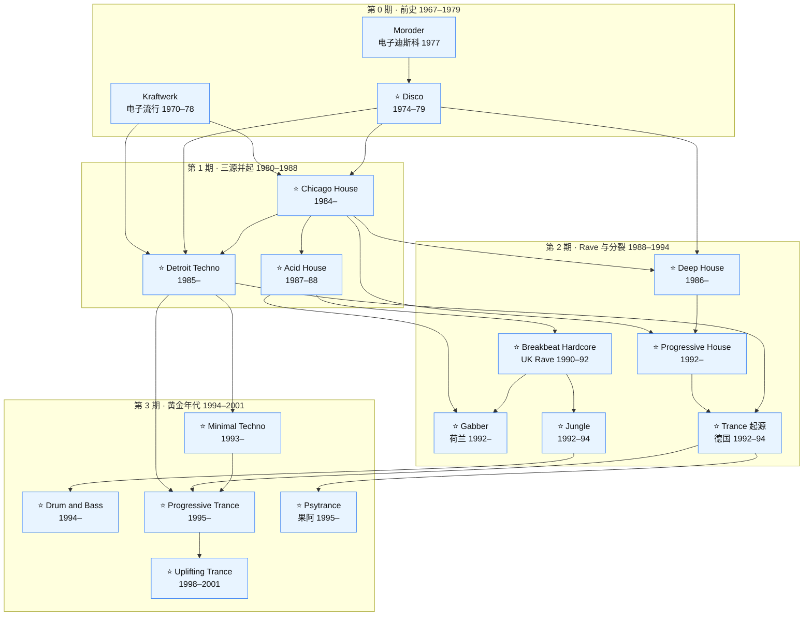
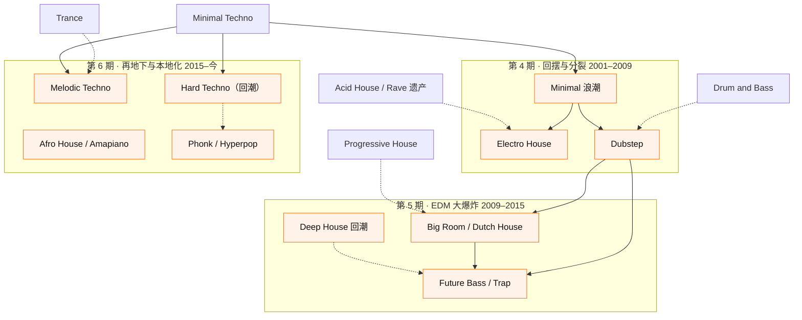

# 谱系图 · 谁从谁那里来

> **配套**：[演进时间线](演进时间线.md)（按时间）· [曲风索引](曲风索引.md)（进度）
> **读法**：实线 = 直接血缘（主要继承）；虚线 = 间接影响 / 阶段二的延续；`⭐` = 阶段一要做的 16 张卡片

---

## 一、阶段一 · 第 0 ~ 3 期主谱系（实线 = 直接血缘）

> 说明（看图要点）：
> - **Disco 是分水岭**：往上接合成器前史，往下同时喂了 House 与 Techno（Techno 走「欧洲合成器 + House 节奏」路线）
> - **House 与 Techno 是表亲不是父子**：都吃 Disco，但 Techno 更亲 Kraftwerk / 欧洲电子
> - **第 2 期是所有分支的爆炸点**：Breackbeat Hardcore 一支往下拆出 Jungle → DnB；另两支分别是 Gabber（求快求硬）与 Trance/Progressive（求旋律求氛围）

---

## 二、阶段二 · 第 4 ~ 6 期延续（虚线 = 间接影响）

---

## 三、跨主干「旁支」提示（不立卡，供查参考底本）

| 曲风 | 血缘 | 为什么不立卡 |
|------|------|-------------|
| Ambient / Ambient House | House + 环境音乐 | 非舞曲（听感向），`Genres/Ambient*.md` |
| IDM / Braindance | Techno + Breakbeat 的实验化 | 反舞池，刻意不可跳舞 |
| Breakcore / Mashcore | Gabber + Jungle + 数字硬核 | 边缘（用户已有笔记：`Genres/电子音乐曲风/`） |
| Trip Hop / Downtempo | Hip-Hop + 氛围 | 非舞曲 |
| Synthwave | 80s 电子流行复古 | 非舞曲（怀旧向） |
| Trap / Hip-Hop | 说唱为主 | 只在 2012 后作为 EDM 成分出现 |

---

## 四、易混对照速查（详细辨析写在各自卡片）

| A | B | 一句话区分 |
|:--|:--|-----------|
| Chicago House | Detroit Techno | House = 温暖、人声、4/4 摇摆；Techno = 冷、机械、无人声、未来主义 |
| Acid House | Acid Techno | 同一个 303，House 更律动、Techno 更硬更快 |
| Deep House | Progressive House | Deep 更慢更闷更爵士；Prog 更亮更长更「旅程感」 |
| Progressive House | Progressive Trance | Prog House 鼓更实、结构更平；Prog Trance 有 breakdown + 大旋律 |
| Progressive Trance | Uplifting Trance | Uplifting = 更强调旋律琶音 + 更频繁 BBA（Build-up–Breakdown–Anthem）结构，速度 135–142 |
| Trance | Psytrance | Psy 更快（140–150+）、Bass 走滚动 16 分、迷幻音效、结构更少 breakdown |
| Jungle | Drum and Bass | 同源，Jungle 更雷鬼/采人声，DnB 更快更干净更技术化 |
| Gabber | Hardcore Techno | 同义近亲，Gabber 特指荷兰 180+ BPM 失真底鼓场景 |
